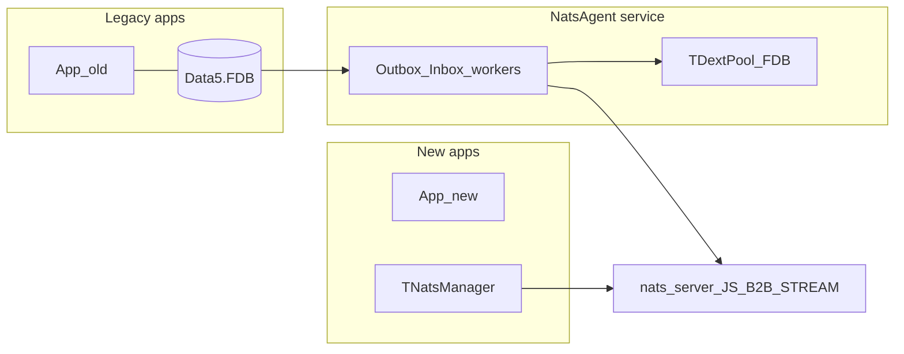
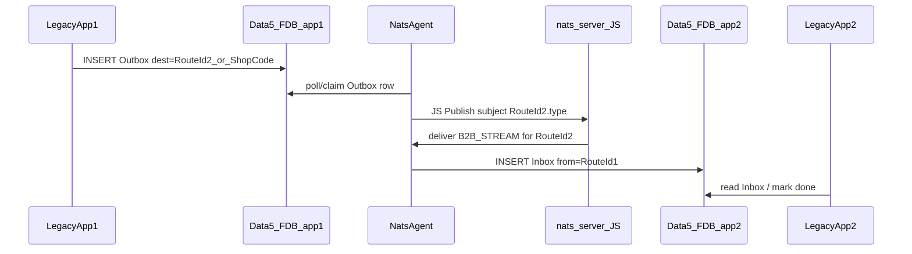
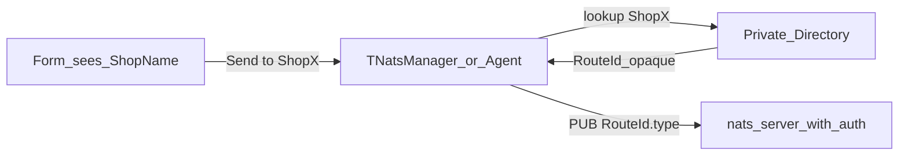

# NATS B2B Agent — پیش‌نویس همفکری

> ذخیره برای بعد. جزئیات کانال اپ↔Agent و استقرار هنوز قطعی نیست؛ فرض‌های زیر قابل تغییرند.  
> مرجع پلن Cursor: همگام با مباحث طراحی B2B + `TNatsManager` + امنیت RouteId.

## هدف

معماری **دو مسیره** روی یک bus مشترک NATS/JetStream (`B2B_STREAM`):

| مسیر | کی | چطور |
|------|-----|------|
| **A — Legacy via Agent** | اپ‌های قدیمی که نباید/نمی‌توان Dext.Nats گرفت | سرویس **NatsAgent** روی سرور ↔ FDB Outbox/Inbox |
| **B — Native client** | اپ‌های **جدید** با کلاینت thread-safe داخل‌پردازه‌ای | `TNatsManager` روی `TDextNatsClient` (Recv/Ping داخلی؛ UI با Queue) |

هر دو مسیر **همان قرارداد subject/envelope** را رعایت می‌کنند تا پیام بین legacy و new بدون ترجمهٔ پروتکل رد و بدل شود.

**امنیت هویت:** روی سیم NATS از **RouteId مات** استفاده می‌شود، نه UUID تجاری (جزئیات در بخش امنیت).



## فرض‌های موقت

| موضوع | فرض پیش‌فرض |
|--------|-------------|
| کانال اپ قدیمی↔Agent | جداول **Outbox / Inbox** داخل همان FDB |
| استقرار Agent | **یک سرویس واحد** + `TDextPool` / `AcquireScoped` برای FDBها (harden در Dext `45bf6fb…`) |
| اپ جدید | یک `TNatsManager` per process روی یک `TDextNatsClient` |
| هویت | `UUID` تجاری + **`RouteId` تصادفی**؛ subject فقط با RouteId |
| Stream | `B2B_STREAM` |

## مسیر A — جریان legacy app1 → app2



## مسیر B — `TNatsManager` (فرم‌پسند)

`TDextNatsClient` خودش Recv/Ping دارد؛ Worker فقط برای marshal به UI است.

```delphi
Manager.Connect('127.0.0.1', 4222);
Manager.StartListening; // SUB {ownRouteId}.>
Manager.OnMessage := procedure(const M: TB2BMessage)
begin
  Memo1.Lines.Add(M.FromRoute + ': ' + M.Body); // UI thread
end;

Manager.PublishToShop('فروشگاه مرکزی', 'chat', Edit1.Text);
// یا Manager.PublishTo(RouteId, 'chat', Edit1.Text);
```

قوانین: یک Manager per process؛ از فرم مستقیم Client صدا نزن؛ روی بستن `Drain`/`Disconnect`.

## اجزای Agent (MVP — مسیر A)

1. Config — AppRoot، FDB، UUID، RouteId، Mode  
2. DbPool — `TDextPool` + `AcquireScoped`  
3. OutboxWorker / InboxWorker  
4. NatsClient داخل سرویس  
5. Observability  

## اجزای SDK اپ جدید (MVP — مسیر B)

1. Shared envelope + subject helpers  
2. `TNatsManager` + صف UI  
3. زیر آن فقط `TDextNatsClient`  
4. دموی کوچک Send/Receive  

## قرارداد subject (با امنیت RouteId)

- Publish: `{destRouteId}.{messageType}`  
- Subscribe self: `{ownRouteId}.>`  
- Envelope: `MsgId`, `FromRoute`, `ToRoute`, `Type`, `Body`, `CreatedAt`, `SchemaVersion`  
- Idempotency: `Nats-Msg-Id` = `MsgId`  
- **UUID تجاری روی subject / Name کلاینت / لاگ عمومی نباشد**

## ایده‌های بهبود B2B (فراتر از MVP)

### P0
1. Idempotency  
2. وضعیت Outbox/Inbox  
3. DLQ  

### P1
4. Directory نام → RouteId  
5. Health Agent  
6. SchemaVersion  
7. Request/Reply در Manager  

### P2
8. Shard چند Agent  
9. NKey/JWT + محدود subject  
10. فایل بزرگ → Object Store  
11. compression=s2 روی stream  

### P3
12. Presence  
13. Broadcast کنترل‌شده  
14. ممیزی  
15. Hybrid offline  

### پیشنهاد نمی‌شود اول کار
- NATS client جدا per فرم؛ اشتراک client بین processها؛ business داخل Agent  

## امنیت: پنهان‌سازی هویت / عدم فاش UUID

هدف: شنود NATS نباید نقشهٔ «کدام فروشگاه = کدام UUID» بسازد.

### اصل مهم

**Subject عمومی ≠ UUID تجاری.**  
روی سیم فقط **RouteId مات**.

### لایه‌ها

| لایه | کار | اثر |
|------|-----|-----|
| **1. Alias / RouteId** | RouteId تصادفی جدا از UUID؛ subject = `{RouteId}.>` | لو نرفتن UUID کسب‌وکار |
| **2. Directory خصوصی** | فقط Agent/سرور: Name → RouteId | UI فقط اسم می‌بیند |
| **3. Authorization** | NKey/JWT: SUB فقط own RouteId؛ PUB فقط مقصدهای مجاز | دانستن subject کافی نیست |
| **4. بدون wildcard سراسری** | فقط `{ownRouteId}.>` | enumeration کمتر |
| **5. رمز بدنه** | اختیاری per-pair/tenant | محرمانگی محتوا |
| **6. Account جدا** | multi-tenant NATS | ایزولهٔ سخت‌تر |

### الگو



1. داخلی: UUID تجاری + RouteId قابل‌چرخش  
2. NATS: فقط RouteId در subject  
3. Envelope: FromRoute/ToRoute؛ UUID روی سیم فقط اگر رمز شده  
4. `PublishToShop(name, …)` → Directory → RouteId  
5. Outbox: ToShopCode / ToRouteId؛ نه UUID در لاگ عمومی  

### چرخش هویت

RouteId را عوض کن؛ UUID تجاری را عوض نکن.

### اشتباهات رایج

- UUID در `Name=` کلاینت NATS  
- لاگ subject + نام فروشگاه کنار هم در فایل عمومی  
- یک user مشترک با اجازهٔ `>` برای همهٔ اپ‌ها  

### حداقل MVP امنیتی

- [ ] RouteId جدا از UUID  
- [ ] Directory فقط سمت سرور/Agent  
- [ ] credential per app (یا per Agent برای legacy) با SUB روی RouteId خودش  
- [ ] بدون UUID در subject و `Name` کلاینت  

## فازهای بعدی

- [ ] قطعی کردن Outbox schema  
- [ ] تصمیم consumer Agent  
- [ ] retry / DLQ  
- [ ] Windows Service  
- [ ] `TNatsManager` + دموی فرم  
- [ ] همزیستی legacy↔new  
- [ ] تست ۲–۳ app واقعی  
- [ ] (امنیت) RouteId + Directory + auth  
- [ ] (اختیاری) Request/Reply + Directory نام  

## غیرهدف‌های MVP

- وادار کردن کلاینت قدیمی به Dext.Nats  
- دو envelope متفاوت برای A و B  
- business داخل Agent  

## پیوندها

- [`NATS_FUTURE_PLAN.md`](NATS_FUTURE_PLAN.md) — توسعهٔ کتابخانهٔ Dext.Nats  
- [`../AGENTS.md`](../AGENTS.md) — قرارداد threading کلاینت  
