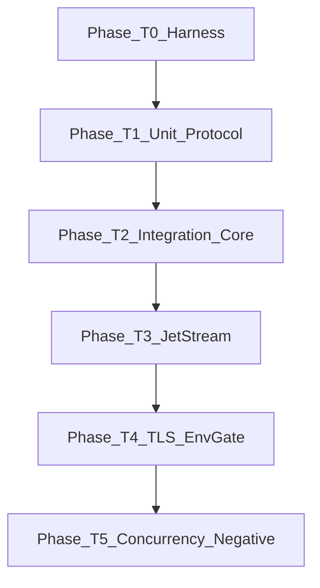

# برنامهٔ جامع تست — Dext.Nats (`TEST_PLAN`)

> **هدف:** پوشش کامل لایهٔ پروتکل، کلاینت cleartext، JetStream (pull)، TLS، همزمانی، و مسیرهای خطا — بدون پیاده‌سازی در این سند.  
> **وضعیت فعلی:** suite پیش‌فرض با سرور `-js` (Unit+Integration+JetStream+KeyValue+ObjectStore+DI+Observability؛ TLS/NKey soft-skip بدون env؛ Stress Explicit کنار). `DEXT_NATS_REQUIRE_LIVE=1` برای fail سخت. Fixture TLS: `Tests/tls/`؛ NKey: `Tests/nkey/`. KV: `TDextNatsKeyValueTests` (Put/Get/Delete/Purge/Keys/History/WatchAll؛ CAS deferred). Object Store: Put/Get/Delete/List/Keys؛ Watch/Seal/UpdateMeta deferred.  
> **کامپایلر:** فقط Delphi 12 / Studio **23.0** (`dcc32`).  
> **چارچوب:** `Dext.Testing` + `Should()`؛ فقط `Dext.Collections`.  
> **مرجع تاریخی فازها:** `nats_complete_phased_d5d5e289.plan.md` (فاز ۱–۳ feature کامل شده؛ این سند فازهای *تست* بعدی است).

---

## ۱. خلاصهٔ اجرایی / Executive summary

| لایه | وضعیت امروز | هدف این پلن |
|------|-------------|-------------|
| Unit (بدون سرور) | ۱۰ تست پروتکل/گزینه/JS parse | گسترش پارسر، encoders، headers، JSON helpers، Stream/Consumer ToJson/Parse، ack payload |
| Integration cleartext | ۴ تست (connect / pub-sub / req-reply / 503) | queue groups، headers، reconnect/outbox، Flush/Ping، MaxPayload، Unsubscribe |
| JetStream | ۱ تست round-trip Fetch+Ack | CRUD/update stream، dedup، consumer CRUD، batch Fetch، Nak/Term/InProgress، redelivery |
| TLS | ۱ تست همیشه Ignore | env-gated handshake با `VerifyServerCertificate=False` |
| Concurrency / stress | ندارد | multi-sub، claim-gate timeout race، ping stale disconnect |
| Negative | جزئی (503، JS missing) | -ERR، timeout، stream not found، MaxPayload، parse ceiling |

**Demo** (`Demo/JetStreamSmokeTest`) مکمل دستی است، نه جایگزین suite.

---

## ۲. موجودی فعلی (Gap analysis)

### ۲.۱ فایل‌ها

| مسیر | نقش |
|------|-----|
| `Tests/Dext.Net.Nats.Tests.dpr` | برنامهٔ کنسول؛ `RunTests(ConfigureTests.Verbose.RegisterFixtures([...]))` |
| `Tests/Dext.Net.Nats.Tests.pas` | همهٔ fixtures فعلی در **یک** یونیت |
| `Tests/*.dproj` | **وجود ندارد** — باید اضافه شود (الگوی `JetStreamSmokeTest.dproj`) |
| `Demo/JetStreamSmokeTest/` | smoke تعاملی: stream create/info، dedup publish، Fetch+Ack، delete |
| `Source/Dext.Net.Nats.{Protocol,pas,JetStream}.pas` | API عمومی تحت تست |

### ۲.۲ Fixtures و تست‌های موجود

#### `TDextNatsProtocolTests` — Unit (بدون سرور) — **۱۰**

| ID | متد | پوشش |
|----|-----|------|
| U-01 | `Parser_ShouldDecodeInfoFrame` | INFO + `TNatsServerInfo.Parse` (connect_urls, max_payload, headers) |
| U-02 | `Parser_ShouldDecodeInfoTlsRequired` | `tls_required` |
| U-03 | `Parser_ShouldDecodeMsgFrame` | MSG + payload |
| U-04 | `Parser_ShouldDecodeHMsgWithStatusAndHeaders` | HMSG + status 503 + header GetValue |
| U-05 | `Parser_ShouldDecodePing` | PING |
| U-06 | `Encode_ShouldBuildPubAndSubFrames` | `NatsEncodePub`, `NatsEncodeSub` (با queue) |
| U-07 | `ConnectOptions_ShouldDefaultNoResponders` | defaults + `ToJson` شامل `no_responders` |
| U-08 | `ClientOptions_ShouldDefaultTlsDisabled` | `TDextNatsOptions.TLS` |
| U-09 | `ConsumerConfig_ShouldSerializeDefaults` | `TNatsConsumerConfig.ToJson` |
| U-10 | `JsMsg_ShouldParseAckSubjectMetadata` | `TNatsJsMsg.FromNatsMsg` از `$JS.ACK.*` |

#### `TDextNatsIntegrationTests` — cleartext `127.0.0.1:4222` — **۴**

| ID | متد | پوشش |
|----|-----|------|
| I-01 | `Connect_ShouldHandshake` | Connect + `ServerInfo.ServerId` |
| I-02 | `PublishSubscribe_ShouldDeliverPayload` | Publish string + Subscribe handler |
| I-03 | `RequestReply_ShouldRoundTrip` | Request/Reply |
| I-04 | `Request_NoResponders_ShouldRaise` | `EDextNatsNoResponders` |

**سیاست skip:** `EnsureServerOrFail` بدون سرور **soft-skip** می‌کند (`Exit` بدون assert)؛ با `DEXT_NATS_REQUIRE_LIVE=1` fail سخت. `DEXT_NATS_SKIP_LIVE=1` همیشه soft-skip.

#### `TDextNatsJetStreamTests` — نیاز به `nats-server -js` — **۱**

| ID | متد | پوشش |
|----|-----|------|
| J-01 | `Consumer_FetchAndAck_ShouldRoundTrip` | CreateStream (memory) → CreateConsumer → Publish(+MsgId) → Fetch(1) → Ack → empty Fetch → DeleteConsumer → DeleteStream |

**سیاست:** soft-skip اگر سرور نباشد یا `ServerInfo.Jetstream=false`؛ با `DEXT_NATS_REQUIRE_LIVE=1` fail سخت.

#### `TDextNatsTlsIntegrationTests` — **۳ (env-gated soft-skip)**

| ID | متد | پوشش |
|----|-----|------|
| T-01 | `Connect_Tls_ShouldHandshakeWhenConfigured` | soft-skip بدون `DEXT_NATS_TLS_PORT`؛ live با `Tests/tls`؛ `VerifyServerCertificate=False` |
| T-02 | `PublishSubscribe_Tls_ShouldDeliverWhenConfigured` | Pub/Sub روی TLS |
| T-03 | `RequestReply_Tls_ShouldRoundTripWhenConfigured` | Request/Reply روی TLS |

### ۲.۳ شکاف‌های مهم نسبت به API عمومی

**Protocol هنوز بدون تست اختصاصی:**

- `NatsEncodeConnect` / `NatsEncodeHPub` / `NatsEncodeUnsub` / `NatsEncodePing` / `NatsEncodePong`
- `TNatsHeadersHelper` کامل (Add/SetValue/IndexOf/Count/Encode)
- `NatsJsonEscape` / `NatsJsonGet*` / `NatsBoolStr` / `NatsNewInbox`
- پارسر: PONG، +OK، -ERR، MSG با reply-to، HMSG با payload، fragmented Append، `Clear`، سقف `MaxFrameBytes` / `NATS_MAX_FRAME_BYTES`
- `TNatsServerInfo.Parse`: `jetstream`, `auth_required`, `tls_available`, `nonce`

**Client بدون پوشش:**

- Queue group، `PublishWithHeaders` / `RequestWithHeaders`، `RequestAsync`
- `Unsubscribe` / `UnsubscribeSubject` / `MaxMsgs` auto-unsub
- `Flush` / `Ping`، `NewInbox`
- Reconnect + outbox + `ResendSubscriptions` + چرخش `ConnectUrls`
- `EnsurePayloadAllowed` / MaxPayload
- رویدادهای `OnConnected` / `OnDisconnected` / `OnError`
- claim-gate race در timeout Request

**JetStream بدون پوشش (در suite؛ بخشی در Demo):**

- `UpdateStream`, `GetStreamInfo` standalone, `StreamExists` false path
- Dedup `Duplicate=True` (Demo دارد، تست خودکار ندارد)
- `Publish` با `TNatsJetStreamPublishOptions` (ExpectedStream / ExpectedLastSequence)
- Nak / Term / InProgress + redelivery بعد از Nak / عدم redelivery بعد از Term
- Fetch batch > 1، empty fetch / control msgs (408/404)
- `TNatsStreamConfig.ToJson` / `TNatsStreamInfo.Parse` / `TNatsPublishAck.Parse` / error object → `EDextNatsJetStreamError`
- encoding ack: `+ACK`, `+NAK`, `+NAK {"delay":...}`, `+TERM`, `+WPI` (قابل unit با spy یا با بررسی wire اگر helper جدا شود؛ فعلاً از طریق رفتار سرور)

**عمداً خارج از scope (مطابق AGENTS.md):**

- DI، observability، push consumers، KV/Object Store (NKey/JWT و README اضافه شده‌اند)

---

## ۳. اصول طراحی تست

1. **جداسازی لایه‌ها:** unit هرگز TCP نمی‌زند؛ integration فقط وقتی سرور در دسترس است.
2. **الگوی Dext.Net:** مثل `Dext.Net.Mqtt.Tests` (unit خالص + integration) و `Dext.Net.Redis.Tests` (TLS با `VerifyServerCertificate=False`).
3. **نام‌گذاری:** `Feature_ShouldExpectedBehavior`؛ subjectها یکتا با timestamp تا تداخل موازی کم شود.
4. **Collections:** فقط `IList`/`IDictionary` از `Dext.Collections` / `TCollections` — هرگز RTL Generics.
5. **Cleanup:** هر تست JS در `try/finally` استریم/consumer خود را پاک کند؛ ترجیح `ssMemory` مثل Demo.
6. **Threading:** handlerها روی RecvLoop؛ در تست‌ها از `TEvent`/`WaitFor` استفاده شود (الگوی موجود). آزاد کردن `TEvent` فقط بعد از claim یا اتمام wait.
7. **Assertions:** فقط `Should(...)` از `Dext.Testing.Fluent`.

---

## ۴. ماتریس تست هدف (کامل)

شناسه‌ها برای ردیابی پیاده‌سازی بعدی هستند. ستون **وضعیت:** `EXISTS` / `ADD`.

### ۴.۱ Unit — بدون سرور (`Category('Unit')`)

#### ۴.۱.۱ Frame parser

| ID | سناریو | وضعیت | نکات |
|----|--------|-------|------|
| U-01..U-05 | INFO / INFO tls / MSG / HMSG503 / PING | EXISTS | نگه دار |
| U-11 | Parse PONG | ADD | |
| U-12 | Parse +OK | ADD | |
| U-13 | Parse -ERR → `nfErr` + `ErrorText` | ADD | |
| U-14 | MSG با reply-to (`MSG sub sid reply n`) | ADD | |
| U-15 | HMSG با headers + payload غیرخالی | ADD | hdr_len ≠ total_len |
| U-16 | Incremental: Append تکه‌تکه → یک frame | ADD | چند Append قبل از TryReadFrame |
| U-17 | چند frame پشت‌سرهم در یک buffer | ADD | |
| U-18 | `Clear` بعد از دادهٔ ناقص → بدون frame زامبی | ADD | |
| U-19 | سقف `MaxFrameBytes` → `EDextNatsProtocolError` (یا رفتار مستند) | ADD | |
| U-20 | INFO با `jetstream:true` و `auth_required` | ADD | |

#### ۴.۱.۲ Encoders

| ID | سناریو | وضعیت |
|----|--------|-------|
| U-06 | PUB + SUB(+queue) | EXISTS |
| U-21 | `NatsEncodePub` با reply-to | ADD |
| U-22 | `NatsEncodeHPub` بدون/با reply-to | ADD |
| U-23 | `NatsEncodeConnect` با پیشوند `CONNECT ` و CRLF | ADD |
| U-24 | `NatsEncodeUnsub` بدون/با max | ADD |
| U-25 | `NatsEncodePing` / `NatsEncodePong` | ADD |

#### ۴.۱.۳ Headers + JSON helpers

| ID | سناریو | وضعیت |
|----|--------|-------|
| U-26 | Headers Add / SetValue / GetValue / IndexOf / Count | ADD |
| U-27 | Headers.Encode → بلوک `NATS/1.0` + blank line | ADD |
| U-28 | `NatsJsonEscape` برای `"` و `\` و کنترل‌کاراکتر | ADD |
| U-29 | `NatsJsonGetStr/Int/Int64/Bool` + defaults | ADD |
| U-30 | `NatsBoolStr` | ADD |
| U-31 | `NatsNewInbox` یکتا و با پیشوند `_INBOX.` | ADD |

#### ۴.۱.۴ JetStream config / parse / ack encoding (خالص)

| ID | سناریو | وضعیت |
|----|--------|-------|
| U-09 | ConsumerConfig defaults ToJson | EXISTS |
| U-10 | JsMsg FromNatsMsg metadata | EXISTS |
| U-32 | `TNatsStreamConfig.CreateDefault` + `ToJson` (subjects, retention, storage, duplicate_window) | ADD |
| U-33 | `TNatsStreamInfo.Parse` موفق | ADD |
| U-34 | `TNatsStreamInfo.Parse` با `"error"` → `EDextNatsJetStreamError` (Code/ErrCode) | ADD |
| U-35 | `TNatsConsumerInfo.Parse` | ADD |
| U-36 | `TNatsPublishAck.Parse` (+ duplicate) | ADD |
| U-37 | `TNatsPublishAck.Parse` error object | ADD |
| U-38 | ConsumerConfig enumها: deliver/ack/replay variants در JSON | ADD |
| U-39 | Ack wire strings (اگر قابل استخراج بدون I/O): `+ACK`, `+NAK`, delay ns، `+TERM`, `+WPI` | ADD | در غیر این صورت فقط از طریق integration J-* اثبات شود |

**تخمین unit هدف:** ~۳۵–۴۰ تست (۱۰ موجود + ~۲۵–۳۰ جدید).

---

### ۴.۲ Integration cleartext (`Category('Integration')`)

**پیش‌نیاز:** `nats-server` روی `127.0.0.1:4222` (بدون الزام `-js`).

| ID | سناریو | وضعیت | جزئیات |
|----|--------|-------|--------|
| I-01 | Connect handshake | EXISTS | |
| I-02 | Pub/Sub payload | EXISTS | |
| I-03 | Request/Reply | EXISTS | |
| I-04 | No-responders 503 | EXISTS | |
| I-05 | Queue group: دو subscriber یک queue → فقط یکی پیام را می‌گیرد | ADD | شمارش با `TInterlocked` |
| I-06 | `PublishWithHeaders` + دریافت HMSG در handler | ADD | |
| I-07 | `RequestWithHeaders` round-trip | ADD | |
| I-08 | `Unsubscribe` فوری → پیام بعدی نرسد | ADD | |
| I-09 | `Unsubscribe(..., MaxMsgs)` auto-cancel | ADD | |
| I-10 | `Flush` بعد از Publish تضمین تحویل به سرور | ADD | |
| I-11 | `Ping` + `Flush` (PONG path) | ADD | |
| I-12 | `MaxPayload`: Publish بزرگ‌تر از `ServerInfo.MaxPayload` → exception واضح | ADD | ساخت `TBytes` oversized |
| I-13 | Reconnect + outbox: قطع socket مصنوعی، Publish در حین disconnect، پس از reconnect پیام برسد | EXISTS | `MaxPingsOutstanding=0` → PingLoop socket close؛ Publish در `OnDisconnected` → outbox |
| I-14 | Resubscribe بعد از reconnect | EXISTS | Publish تازه بعد از reconnect |
| I-15 | `RequestAsync` reply و timeout callback | ADD | |
| I-16 | `OnConnected` / `OnDisconnected` fire می‌شوند | ADD | |
| I-17 | Wildcard subscribe `dext.nats.test.>` | ADD | اختیاری اما کم‌هزینه |
| I-18 | Binary payload (bytes غیر UTF-8) | ADD | |

**تخمین:** ۴ موجود + ~۱۲–۱۴ جدید.

---

### ۴.۳ JetStream (`Category('JetStream')`)

**پیش‌نیاز:** `nats-server -js`؛ `ServerInfo.Jetstream=true`.

| ID | سناریو | وضعیت | منبع الهام |
|----|--------|-------|------------|
| J-01 | Fetch + Ack round-trip | EXISTS | — |
| J-02 | Stream CRUD: Create → GetStreamInfo → StreamExists → Delete | ADD | Demo steps 5–6, 13 |
| J-03 | `UpdateStream` (مثلاً تغییر subjects یا max_msgs) | ADD | API موجود |
| J-04 | Dedup: دو Publish با یک `Nats-Msg-Id` → دوم `Duplicate=True`، Messages=1 | ADD | Demo steps 7–9 |
| J-05 | Consumer CRUD: Create → GetConsumerInfo → Delete | ADD | بخشی در J-01 |
| J-06 | Fetch batch (مثلاً ۳ پیام، batch=3) | ADD | |
| J-07 | Nak → redelivery در Fetch بعدی | ADD | AckWait کوتاه در config |
| J-08 | Term → دیگر redeliver نشود | ADD | |
| J-09 | InProgress (+WPI) تمدید AckWait (timeout بلندتر قبل از redelivery) | ADD | زمان‌حساس؛ ممکن است flaky → timeoutهای محافظه‌کار |
| J-10 | Publish options: `ExpectedStream` mismatch → `EDextNatsJetStreamError` | ADD | |
| J-11 | Fetch خالی وقتی پیامی نیست (timeout expires) → Count=0 | ADD | جزئی در J-01 |
| J-12 | StreamExists روی نام ناموجود → False (نه raise) | ADD | |
| J-13 | GetStreamInfo ناموجود → raise با Code/ErrCode | ADD | |

**تخمین:** ۱ موجود + ~۱۰–۱۲ جدید. Demo می‌ماند برای smoke دستی کامل.

---

### ۴.۴ TLS (`Category('TLS')`)

| ID | سناریو | وضعیت | سیاست |
|----|--------|-------|--------|
| T-01 | Connect با `TLS.Enabled` / سرور `tls_required` | EXISTS | env-gated soft-skip بدون `DEXT_NATS_TLS_PORT` |
| T-02 | Pub/Sub روی اتصال TLS | EXISTS | همان endpoint |
| T-03 | Request/Reply روی TLS | EXISTS | تأیید با `Tests/tls/nats-tls.conf` روی ۴۲۲۳ |

**پیش‌نیاز محلی:**

- `nats-server` با TLS (cert خودامضا کافی است)
- OpenSSL DLLs کنار exe (`libssl-3.dll`, `libcrypto-3.dll` — مثل Output فعلی)
- Env:
  - `DEXT_NATS_TLS_HOST` (پیش‌فرض `127.0.0.1`)
  - `DEXT_NATS_TLS_PORT` (**الزامی** برای اجرا؛ اگر خالی → skip)
- Options: `TDextTLSOptions.DefaultClient`، `VerifyServerCertificate := False`

الگوی Redis: `Dext.Net.Redis.Tests.TestSSLConnection`.

---

### ۴.۵ Concurrency / stress (`Category('Stress')`)

| ID | سناریو | وضعیت | ریسک |
|----|--------|-------|------|
| S-01 | چند subscription موازی روی subjectهای مختلف + publish همزمان | ADD | race روی FSubscriptions |
| S-02 | چند Request همزمان از threadهای مختلف | ADD | claim gate / inbox |
| S-03 | Request timeout درست وقتی reply دیر می‌رسد: بدون AV/double-free (claim gate) | ADD | timeout خیلی کوتاه + responder عمداً دیر |
| S-04 | `MaxPingsOutstanding` + `PingIntervalMs` کوتاه → stale → Disconnect socket از PingLoop → RecvLoop reconnect (اگر AllowReconnect) | EXISTS | Explicit؛ `MaxPingsOutstanding=0` برای القای stale قطعی |
| S-05 | فشار Publish زیاد در حین reconnect با سقف `MaxPendingBufferBytes` | EXISTS | Explicit؛ buffer=32 → reject در `OnDisconnected` |

**توصیه:** Stress را در CI پیش‌فرض **اجرا نکن**؛ فقط با فیلتر دسته یا env.

---

### ۴.۶ Negative / error paths (`Category('Negative')` — می‌تواند روی fixtures دیگر هم بنشیند)

| ID | سناریو | لایه |
|----|--------|------|
| N-01 | Connect به پورت بسته → exception واضح | Integration |
| N-02 | Request timeout واقعی (responder نیست و no_responders خاموش؟ یا subject بدون 503) → `EDextNatsTimeoutError` | Integration / Unit options |
| N-03 | JS API روی سرور بدون `-js` → پیام/خطای واضح (امروز EnsureJetStreamOrFail) | JetStream |
| N-04 | CreateStream تکراری با config ناسازگار → `EDextNatsJetStreamError` | JetStream |
| N-05 | DeleteConsumer ناموجود | JetStream |
| N-06 | Publish قبل از Connect → رفتار مستند (reject/buffer) | Client |
| N-07 | Handler exception → `OnError` (بدون کشتن RecvLoop) | Integration |
| N-08 | Protocol garbage در parser → `EDextNatsProtocolError` | Unit |

---

## ۵. چیدمان پروژه / Project layout

### ۵.۱ پیشنهاد ساختار (فازبندی‌شده)

**فاز A (حداقل تغییر — ترجیحی ابتدا):** نگه داشتن یک یونیت، فقط fixtureها و `[Category]` اضافه شود:

```
Tests/
  Dext.Net.Nats.Tests.dpr
  Dext.Net.Nats.Tests.dproj          ← ADD (Studio 23.0)
  Dext.Net.Nats.Tests.pas            ← گسترش fixtures موجود
```

**فاز B (وقتی یونیت بزرگ شد ~۱۰۰+ تست):** شکستن اختیاری:

```
Tests/
  Dext.Net.Nats.Tests.dpr            ← RegisterFixtures همه
  Dext.Net.Nats.Tests.dproj
  Dext.Net.Nats.Tests.Protocol.pas   ← Unit
  Dext.Net.Nats.Tests.Client.pas     ← Integration + Stress + Negative client
  Dext.Net.Nats.Tests.JetStream.pas  ← JS
  Dext.Net.Nats.Tests.Tls.pas        ← TLS
  Dext.Net.Nats.Tests.Support.pas    ← FeedParser, BytesOfUtf8, EnsureServer*, env helpers
```

**دمو (بدون تغییر اجباری):**

```
Demo/JetStreamSmokeTest/
  JetStreamSmokeTest.dpr|.dproj      ← دستی؛ موازی با J-02/J-04 نگه دار
```

### ۵.۲ Search path پیشنهادی برای `.dproj` تست

هم‌تراز Demo:

- `..\Source`
- `..\..\dext\Sources\Common`
- `..\..\dext\Sources\Core`
- `..\..\dext\Sources\Core\Base`
- `..\..\dext\Sources\Core\Json`
- `..\..\dext\Sources\Core\Interception` (در صورت نیاز transitive)
- `..\..\dext\Sources\Net`
- `..\..\dext\Sources\Testing` (و زیرپوشه‌های لازم برای Runner/Fluent/Attributes)

Output: `..\Output\$(Platform)\$(Config)` مثل Demo.

---

## ۶. Fixtures، skip policies، env

### ۶.۱ Categories پیشنهادی

| Category | محتوا | CI پیش‌فرض |
|----------|--------|------------|
| `Unit` | پارسر/encode/JSON/JS parse | بله |
| `Integration` | cleartext core | بله اگر سرویس NATS در job باشد؛ وگرنه skip |
| `JetStream` | `-js` | بله فقط با سرویس `-js` |
| `TLS` | سرور TLS + OpenSSL | خیر (opt-in) |
| `Stress` | race/stale ping | خیر (opt-in) |
| `Negative` | خطاها | همراه لایهٔ والد |

### ۶.۲ سیاست skip (پیاده‌سازی‌شده)

| شرایط | رفتار |
|-------|--------|
| تست Unit | همیشه اجرا |
| `DEXT_NATS_SKIP_LIVE=1` | Integration/JS/TLS/Stress → soft-skip (`Exit` بدون assert) |
| Connect به cleartext شکست | Integration/JS/Stress → **soft-skip**؛ با `DEXT_NATS_REQUIRE_LIVE=1` → **fail** |
| `ServerInfo.Jetstream=false` | JetStream → soft-skip مگر `REQUIRE_LIVE` |
| `DEXT_NATS_TLS_PORT` خالی | TLS → soft-skip (حتی با `REQUIRE_LIVE`؛ TLS جدا env-gated است) |
| TLS port set ولی handshake fail | soft-skip مگر `REQUIRE_LIVE` |
| Stress | فقط با `DEXT_NATS_RUN_STRESS=1`؛ نبود سرور همان سیاست soft-skip/`REQUIRE_LIVE` |

**کمک‌متدهای پیشنهادی در Support:**

```text
function NatsTestHost: string;           // DEXT_NATS_HOST یا 127.0.0.1
function NatsTestPort: Word;             // DEXT_NATS_PORT یا 4222
function LiveServerAvailable: Boolean;
function JetStreamAvailable: Boolean;
function TryGetTlsEndpoint(...): Boolean; // موجود
procedure SkipUnless(ACond: Boolean; const AReason: string);
```

> نکته: اگر `Dext.Testing` متد Skip برنامه‌ای ندارد، از `[Ignore]` شرطی استفاده نکن — یا Assert skip با convention پروژه، یا helper که exception خاصی throw کند که runner به‌عنوان skip بشناسد. در پیاده‌سازی، API واقعی `SkipAttribute` / runner را در `Dext.Testing.Attributes` چک کن.

### ۶.۳ Env vars

| متغیر | معنی |
|-------|------|
| `DEXT_NATS_HOST` / `DEXT_NATS_PORT` | endpoint cleartext (اختیاری) |
| `DEXT_NATS_SKIP_LIVE` | soft-skip همهٔ live (Integration/JS/TLS/Stress) |
| `DEXT_NATS_REQUIRE_LIVE` | **پیش‌فرض خاموش**؛ `=1` → fail سخت وقتی cleartext/JS (یا TLS با port) در دسترس نیست — برای CI زنده |
| `DEXT_NATS_TLS_HOST` / `DEXT_NATS_TLS_PORT` | endpoint TLS |
| `DEXT_NATS_NKEY_HOST` / `DEXT_NATS_NKEY_PORT` | endpoint NKey (port الزامی برای live) |
| `DEXT_NATS_NKEY_SEED` / `DEXT_NATS_NKEY_SEED_FILE` / `DEXT_NATS_CREDS_FILE` | seed یا `.creds` |
| `DEXT_NATS_RUN_STRESS` | فعال‌سازی stress |

---

## ۷. نحوهٔ اجرا (Studio 23.0 / dcc32)

### ۷.۱ پیش‌فرض مسیر کامپایلر

```text
C:\Program Files (x86)\Embarcadero\Studio\23.0\bin\dcc32.exe
```

(روی این ماشین Studio 23.0 نصب است؛ از 37.0 برای این پروژه استفاده **نکن** مگر تصمیم جدا.)

### ۷.۲ بیلد تست (پس از وجود `.dproj`)

از ریشهٔ `dext_nats` یا پوشهٔ Tests:

```bat
set BDS=C:\Program Files (x86)\Embarcadero\Studio\23.0
set PATH=%BDS%\bin;%PATH%

msbuild Tests\Dext.Net.Nats.Tests.dproj /p:Config=Debug /p:Platform=Win32 /t:Build
```

یا مستقیم `dcc32` با `-U` search pathهای Dext (همان لیست Demo + Testing).

خروجی مورد انتظار:

```text
Output\Win32\Debug\Dext.Net.Nats.Tests.exe
```

(نام exe از `program DextNetNatsTests` ممکن است `DextNetNatsTests.exe` باشد — با dproj هم‌نام کن.)

### ۷.۳ اجرای محلی

```bat
rem Cleartext + JetStream
nats-server -js

rem OpenSSL DLLs کنار exe اگر TLS می‌خواهید
Output\Win32\Debug\Dext.Net.Nats.Tests.exe
```

TLS (جدا):

```bat
set DEXT_NATS_TLS_HOST=127.0.0.1
set DEXT_NATS_TLS_PORT=4223
rem nats-server با کانفیگ TLS روی 4223
Output\Win32\Debug\Dext.Net.Nats.Tests.exe
```

Demo:

```bat
nats-server -js
Output\Win32\Debug\JetStreamSmokeTest.exe -no-wait
```

### ۷.۴ CI در برابر local

| محیط | Unit | Integration | JetStream | TLS | Stress |
|------|------|-------------|-----------|-----|--------|
| Dev laptop (سرور روشن) | همه | همه | همه با `-js` | opt-in | opt-in |
| CI بدون سرویس | همه | skip یا job جدا | skip | skip | skip |
| CI با service container `nats:alpine -js` | همه | همه | همه | skip | skip |
| CI nightly | + Stress کوتاه | + TLS اگر secret/cert fixture باشد | | | |

**پیشنهاد CI دو job:**

1. `nats-unit` — فقط Category Unit (سریع، بدون سرویس)
2. `nats-live` — سرویس `nats-server -js` + Integration + JetStream با `DEXT_NATS_REQUIRE_LIVE=1`

---

## ۸. اولویت پیاده‌سازی (فازهای تست)

هم‌راستا با تاریخچهٔ feature (فاز ۱–۳ کامل)، ترتیب **پر کردن شکاف تست**:



### فاز T0 — Harness (۱–۲ ساعت)

- [x] ساخت `Tests/Dext.Net.Nats.Tests.dproj` (Studio 23.0، search path Dext)
- [x] Helperهای skip/env در همان یونیت (`EnvFlagTrue`, `LiveSoftSkipOrFail`, TLS endpoint, `DEXT_NATS_SKIP_LIVE` / `DEXT_NATS_REQUIRE_LIVE`)
- [x] افزودن `[Category('Unit'|'Integration'|'JetStream'|'TLS'|'Stress'|'Negative')]`
- [x] تبدیل TLS از `[Ignore]` دائمی به soft-skip مبتنی بر `DEXT_NATS_TLS_PORT` (بدون API Skip در Dext.Testing)
- [x] `EnsureServerOrFail` / `EnsureJetStreamOrFail` → soft-skip مگر `DEXT_NATS_REQUIRE_LIVE=1`
- [x] تأیید: Unit+Integration+JetStream سبز با سرور محلی `-js`؛ بدون سرور soft-skip؛ TLS بدون env soft-skip

### فاز T1 — Unit پروتکل/encode/JSON/JS parse (اولویت بالا)

- [x] U-11..U-31 (parser + encoders + headers + JSON)
- [x] U-32..U-38 (Stream/Consumer/PubAck parse & ToJson)
- [x] U-39 قرارداد wire ack به‌صورت unit contract (`+ACK`/`+NAK`/`+TERM`/`+WPI`)
- **معیار خروج:** همهٔ Unit بدون سرور سبز؛ CI job واحد ممکن

### فاز T2 — Integration cleartext

- [x] I-05..I-12, I-15..I-18 (queue, headers, unsub, flush/ping, MaxPayload, async, events, binary)
- [x] I-13/I-14 reconnect/outbox/resubscribe (`Reconnect_Outbox_*`, `Resubscribe_AfterReconnect_*`)
- **معیار خروج:** core API عمومی کلاینت در مسیر شاد پوشش دارد

### فاز T3 — JetStream (خودکارسازی Demo)

- [x] J-02..J-13 (CRUD, update, dedup, batch, Nak/Term/InProgress, errors)
- [x] هم‌تراز نگه داشتن Demo به‌عنوان smoke دستی
- **معیار خروج:** نیازی به Demo برای regression اصلی JS نیست

### فاز T4 — TLS

- [x] T-01 env-gated (soft-skip بدون `DEXT_NATS_TLS_PORT`)
- [x] T-02 Pub/Sub روی TLS (همان env)
- [x] T-03 Request/Reply روی TLS
- [x] کانفیگ نمونه + cert خودامضا در `Tests/tls/` (`nats-tls.conf` روی ۴۲۲۳؛ تأیید زنده سبز)
- **معیار خروج:** با env و سرور TLS محلی سبز؛ بدون آن skip تمیز

### فاز T5 — Concurrency + negative سخت

- [x] S-01..S-03 (Explicit؛ با `DEXT_NATS_RUN_STRESS=1`)
- [x] S-04/S-05 stale ping / pending buffer (`StalePing_*`, `PendingBuffer_*`)
- [x] N-01, N-06, N-07, N-08 (+ بخشی از negative در JS)
- [x] N-02 (`Request_Timeout_ShouldRaise`)، N-04 (`CreateStream_IncompatibleDuplicate_*`)، N-05 (`DeleteConsumer_Missing_*`)؛ N-03 همچنان از طریق `EnsureJetStreamOrFail` در JS
- **معیار خروج:** claim-gate و مسیرهای خطای اصلی بدون AV در تست‌های تکرارشونده

---

## ۹. نگاشت API → تست (چک‌لیست سریع)

### `Dext.Net.Nats.Protocol`

| API | تست‌ها |
|-----|--------|
| `TDextNatsFrameParser` | U-01..U-05, U-11..U-19 |
| `TNatsServerInfo.Parse` | U-01, U-02, U-20 |
| `TNatsConnectOptions` | U-07, U-23 |
| `TNatsHeadersHelper` | U-04, U-26, U-27 |
| `NatsEncode*` | U-06, U-21..U-25 |
| `NatsJson*` / `NatsBoolStr` / `NatsNewInbox` | U-28..U-31 |

### `Dext.Net.Nats` (`TDextNatsClient`)

| API | تست‌ها |
|-----|--------|
| Connect/Disconnect/Connected/ServerInfo | I-01, N-01, T-01 |
| Publish / Subscribe | I-02, I-05, I-17, I-18, S-01 |
| PublishWithHeaders | I-06 |
| Unsubscribe* | I-08, I-09 |
| Request* / RequestAsync / NoResponders | I-03, I-04, I-07, I-15, S-02, S-03, N-02 |
| Flush / Ping | I-10, I-11, S-04 |
| MaxPayload | I-12 |
| Reconnect/outbox | I-13, I-14, S-05 |
| Events | I-16, N-07 |
| TLS options + upgrade | U-08, T-* |

### `Dext.Net.Nats.JetStream`

| API | تست‌ها |
|-----|--------|
| Stream Create/Update/Info/Exists/Delete | J-02, J-03, J-12, J-13, U-32..U-34 |
| Consumer Create/Info/Delete | J-01, J-05, U-09, U-35 |
| Publish + dedup + options | J-01, J-04, J-10, U-36, U-37 |
| Fetch | J-01, J-06, J-11 |
| Ack/Nak/Term/InProgress | J-01, J-07, J-08, J-09, U-39 |
| `TNatsJsMsg.FromNatsMsg` | U-10 |

---

## ۱۰. ریسک‌ها و نکات flaky

1. **Reconnect tests** به قطع واقعی TCP وابسته‌اند — در Windows ممکن است زمان‌بندی ناپایدار باشد؛ timeoutها را بلند بگیر و در Stress جدا کن.
2. **InProgress / AckWait** به ساعت سرور حساس است — از AckWait کوتاه (مثلاً ۱–۲s) و Sleep با حاشیه استفاده کن.
3. **TLS self-signed** بدون `VerifyServerCertificate=False` fail می‌شود — عمدی برای local.
4. **نام استریم ثابت** بین تست‌های موازی تداخل می‌کند — از پسوند GUID/زمان استفاده کن (`DEXT_JS_` + unique).
5. **Ping stale (S-04)** اگر reconnect روشن باشد ممکن است تست «disconnect» را ببیند نه «stay down» — رفتار مورد انتظار را صریح assert کن.
6. Doc comment قدیمی `EDextNatsNotSupported` هنوز «TLS not implemented» می‌گوید در حالی که TLS پیاده شده — در تست negative برای TLS از این exception انتظار نداشته باش مگر مسیر واقعاً unimplemented بماند.

---

## ۱۱. Definition of Done (برای کل پلن تست)

- [x] `.dproj` تست با Studio 23.0 بیلد می‌شود
- [x] Category Unit بدون سرور ۱۰۰٪ سبز
- [x] با `nats-server -js`: Integration + JetStream سبز (پیش‌فرض soft-skip؛ CI سخت‌گیر با `DEXT_NATS_REQUIRE_LIVE=1`)
- [x] بدون سرور: liveها soft-skip تمیز (exit code موفقیت‌آمیز مگر `DEXT_NATS_REQUIRE_LIVE=1`)
- [x] TLS بدون env → soft-skip؛ با env+سرور (`Tests/tls`، پورت ۴۲۲۳) → T-01..T-03 سبز
- [x] Stress اختیاری و جدا از CI پیش‌فرض (`DEXT_NATS_RUN_STRESS=1`)
- [x] شکاف‌های بخش ۲.۳ عملی بسته شده‌اند؛ NKey/JWT / DI / push / observability عمداً خارج از scope
- [x] Demo همچنان به‌عنوان smoke دستی قابل اجراست

---

## ۱۲. پیوست — شمارش تقریبی

| سبد | موجود | هدف تقریبی | اولویت فاز |
|-----|-------|------------|------------|
| Unit | ~35 | 35–40 | T1 |
| Integration | ~22 (incl. negatives) | 16–18 | T2 |
| JetStream | ~15 (incl. negatives) | 11–13 | T3 |
| TLS | 3 env-gated | 2–3 env-gated | T4 |
| Stress | 5 opt-in Explicit | 3–5 opt-in | T5 |
| Negative (پراکنده) | N-01..N-08 پوشش عملی | ۸ سناریو | T2–T5 |
| **جمع** | **۷۵ پیش‌فرض / ۸۰ با TLS+Stress** | **~70–80** | — |

---

*برنامهٔ تست؛ وضعیت چک‌باکس‌های فاز T0–T5 با suite فعلی هم‌خوان است. برای TLS زنده: `nats-server -c Tests/tls/nats-tls.conf` و `DEXT_NATS_TLS_PORT=4223`.*
